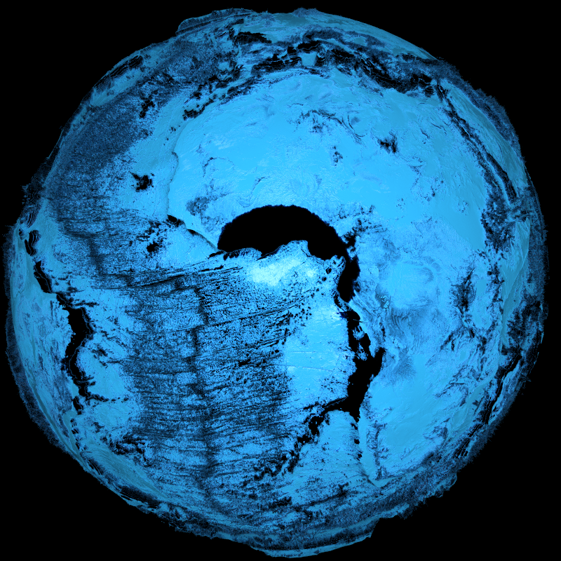

# Topography
This is a topographical viewer that renders views of the earth, both online and offline

#### Online Examples
TODO
#### Offline Examples



## Setup
**To properly use this tool it requires some setup**

This tool was made for the SRTM15+ dataset, though it should technically work with any GDAL compatible dataset that uses the same pixel layout. A semi-modern libgdal is also required (>= 3.11.4).

To download the SRTM15+ dataset, I recommend getting it from [here](https://portal.opentopography.org/raster?opentopoID=OTSRTM.122019.4326.1), once installed I recommend running *scripts/data.py* which performs compressions on the dataset and unifies it into a single file. Which is just a bit easier to work with.

Using a float16 dataset will result in a smaller dataset size and decrease the chance of an OOM error, but will have less accuracy. Using float32 results
in higher accuracy, but will use more RAM and therefore increase the chance of an OOM.

This is how you would create a float16 dataset
```sh
python3 scripts/data.py -f path/to/srtm15.vrt -o path/to/output.tif --f16
```

This is how you would create a float32 dataset
```sh
python3 scripts/data.py -f path/to/srtm15.vrt -o path/to/output.tif --f32
```

Here is how you can audit two different datasets, seeing the range of values, rmse, and max error.
```sh
python3 scripts/data.py -f original/srtm15.vrt -f modified/srtm15.tif --audit
```

## Usage
There are two main modes you can run, an online and offline renderer, respectively, that just means one is meassured in frames per second, and the other in minutes per frame.

This runs the online renderer, which you can view locally on port 8080
```sh
topography -f srtm15plus_f16.tif --server
```

This will render the dataset as images in the renders/output directory
```sh
topography -f srtm15plus_f16.tif --render
```
